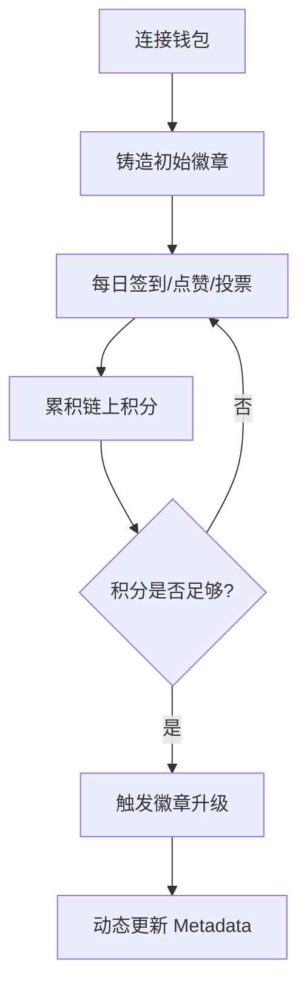

## 1. 产品概述
FanBadge 是一个基于 Monad 区块链构建的高频互动粉丝生态 DApp。它以 NFT Badge（粉丝徽章）作为链上身份载体，通过每日签到、点赞、投票等高频链上互动，为粉丝提供持续成长的身份体系，展示 Monad 高吞吐、低延迟的性能优势。

## 2. 核心功能

### 2.1 用户角色
| 角色 | 注册方式 | 核心权限 |
|------|----------|----------|
| 粉丝用户 | 钱包连接 (MetaMask/RainbowKit) | 铸造徽章、每日签到、参与互动、升级徽章 |

### 2.2 功能模块
1. **首页 (Dashboard)**: 核心互动区（签到、点赞、投票）、个人徽章展示、实时积分动态。
2. **徽章系统 (Badge System)**: 徽章详情查看、升级操作、成长历史记录、多类型徽章收藏。
3. **任务中心 (Task Center)**: 每日任务列表、社区贡献任务、积分奖励领取。
4. **个人主页 (Profile)**: 详细的粉丝数据统计、等级进度条、勋章墙。

### 2.3 页面详情
| 页面名称 | 模块名称 | 功能描述 |
|-----------|-------------|---------------------|
| 首页 | 互动看板 | 包含签到按钮、点赞按钮、歌曲投票等高频操作模块。 |
| 首页 | 个人概览 | 展示当前持有的 NFT 徽章缩略图、等级和当前积分。 |
| 徽章详情 | 成长路径 | 展示徽章升级所需的积分及解锁的新权益/外观变化。 |
| 徽章详情 | 链上记录 | 展示该徽章的所有历史互动行为（链上事件回溯）。 |

## 3. 核心流程
用户连接钱包 -> 初始铸造 (Mint) 粉丝徽章 -> 进行高频互动（签到、点赞等）获得积分 -> 积分达到阈值发起升级 (Upgrade) -> 徽章 Metadata 更新。

## 4. 用户界面设计

### 4.1 设计风格
- **主色调**: 深邃蓝 (#0A0A0B) 配 霓虹紫 (#A855F7) 与 电光青 (#06B6D4)。
- **按钮样式**: 带有微妙发光效果的玻璃拟态 (Glassmorphism) 风格，圆角 R12。
- **字体**: 标题使用 Space Grotesk (极具科技感)，正文使用 Inter。
- **布局**: 模块化卡片布局，大间距，强调视觉呼吸感。
- **动效**: 积分增长时的数字滚动效果，徽章升级时的粒子散射特效。

### 4.2 页面设计概览
| 页面名称 | 模块名称 | UI 元素 |
|-----------|-------------|-------------|
| 首页 | 互动区 | 大尺寸动作按钮，实时反馈的进度条，霓虹描边效果。 |
| 个人主页 | 勋章墙 | 瀑布流布局，徽章悬浮时的 3D 翻转动效。 |

### 4.3 响应式设计
桌面端优先，移动端通过底部导航栏适配，针对触摸屏优化大尺寸交互热区。
