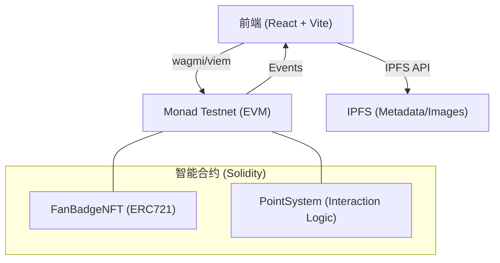
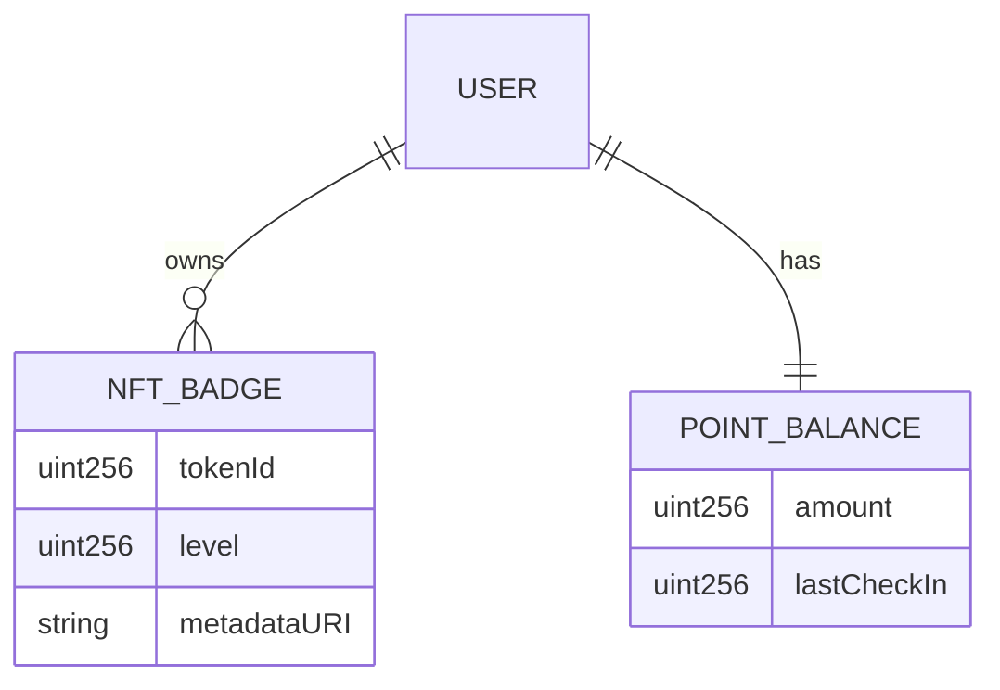

## 1. 架构设计


## 2. 技术栈说明
- **前端**: React@18 + TailwindCSS@3 + Vite + Shadcn/UI
- **Web3 SDK**: wagmi + RainbowKit + viem
- **智能合约**: Solidity + Hardhat + OpenZeppelin
- **区块链**: Monad Testnet (EVM Compatible)
- **存储**: Pinata (IPFS) 用于存储 NFT 媒体资源

## 3. 路由定义
| 路由 | 用途 |
|-------|---------|
| / | 首页 (互动看板与个人概览) |
| /badges | 徽章收藏展示页 |
| /badge/:id | 徽章详情与升级页 |
| /tasks | 任务与活动中心 |

## 4. 智能合约定义 (核心接口)

### 4.1 FanBadgeNFT.sol
```solidity
interface IFanBadgeNFT {
    function mint() external;
    function upgrade(uint256 tokenId) external;
    function getLevel(uint256 tokenId) external view returns (uint256);
}
```

### 4.2 PointSystem.sol
```solidity
interface IPointSystem {
    function checkIn() external;
    function interact(address user, uint256 actionType) external;
    function getPoints(address user) external view returns (uint256);
}
```

## 5. 数据模型 (合约状态)

